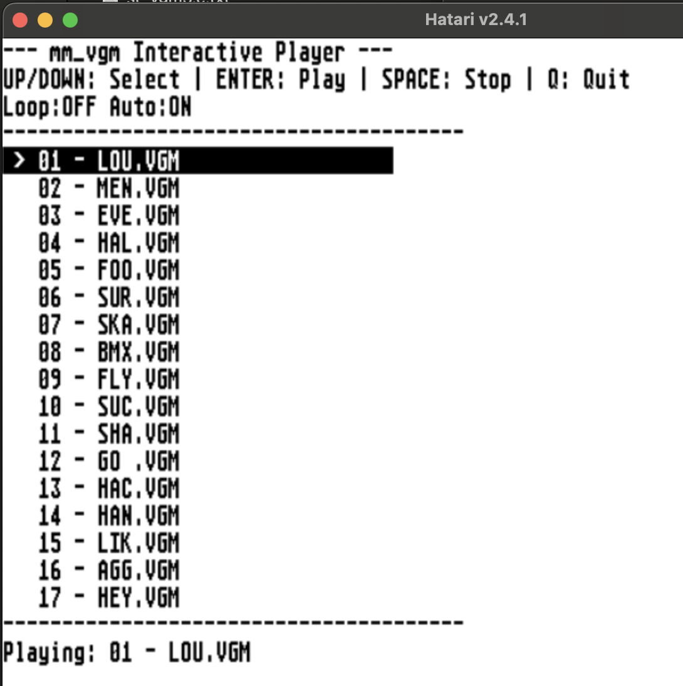
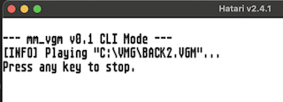

# mm_vgm — SN76489 VGM Player for Atari ST

> A professional-grade VGM/VGZ music player that brings Sega Master System and Game Gear chiptunes to life on real Atari ST hardware through the YM2149 sound chip.


---

## 🎮 What is this?

**mm_vgm** is a hardware music player for the Atari ST family. It reads **VGM** and **VGZ** files — the standard format for logged video game music — and plays them in real time through the ST's built-in **YM2149** sound chip.

The twist? Many of the best VGM files were written for the **SN76489** "PSG" chip found in the Sega Master System, Game Gear, and BBC Micro. The YM2149 in the Atari ST is a different chip with a completely different architecture. This player performs a live, real-time conversion of SN76489 music into YM2149 output, preserving tone pitch, noise character, and volume curves as faithfully as 1985 hardware allows.

### What you get

* 🎵 **Interactive file browser** — browse `.vgm` / `.vgz` files with the arrow keys
* 🎹 **Instant playback** — no conversion step, plays directly from the file
* 🥁 **Authentic percussion** — kick drums and snares that sound like hardware, not white noise
* 🔄 **Loop mode** — seamlessly repeat the current track without reloading from disk
* 🔁 **Autoplay mode** — automatically play the next file when the current one ends
* 📦 **Compressed support** — `.vgz` files decompressed on the fly via zlib
* ⚡ **Low CPU usage** — ~3–4% on a stock 8 MHz ST, leaving the machine responsive

---

## 📸 Screenshots

### Interactive Browser Mode
Launch the player without arguments to browse your collection:



### CLI Mode
Play a single file directly from the command line or by dragging a file onto the TTP:



> *Note: Filenames containing spaces are fully supported in both CLI and drag-and-drop modes.*

---

## 🚀 Getting Started

### Requirements

* An Atari ST, STE, MegaSTE, TT, or Falcon
* **TOS 1.02** or later (or MiNT / FreeMiNT)
* At least **512 KB RAM** (most VGMs fit in 64–256 KB)
* A collection of `.vgm` or `.vgz` files

### Installation

1. Copy `mm_vgm.ttp` to a folder containing your VGM/VGZ files.
2. Double-click `mm_vgm.ttp` to open the interactive browser, **or** drag a `.vgm`/`.vgz` file onto it for instant playback.

### Controls

| Key | Action |
|-----|--------|
| `↑` / `↓` | Navigate file list |
| `Enter` | Play selected file |
| `Space` | Stop playback |
| `L` | Toggle **Loop** mode (repeats current track seamlessly) |
| `A` | Toggle **Autoplay** mode (plays next file automatically) |
| `Q` or `Esc` | Quit |
| *Any key* | Stop playback (CLI mode) |

> **Note:** Loop and Autoplay are mutually exclusive. Enabling one automatically disables the other.

---

## 🎼 Supported File Types

| Format | Extension | Notes |
|--------|-----------|-------|
| VGM | `.vgm` | Raw logged chip music |
| VGZ | `.vgz` | Gzip-compressed VGM (decompressed on load) |
| AY-8910 | inside `.vgm` | `0xA0` commands passed directly to YM2149 (ZX/CPC/MSX tunes) |

### Supported chips

| Chip | Role | Status |
|------|------|--------|
| **SN76489** | Primary PSG | ✅ Full tone + noise conversion |
| **AY-8910** | Direct passthrough | ✅ Native YM2149 playback |
| YM2413 (OPLL) | FM | ❌ Ignored (no SN clock = rejected) |
| YM2612 (OPN2) | FM | ❌ Ignored (FM-only tracks rejected) |

> **Tip:** The player auto-detects the SN clock from the VGM header, so both NTSC (3.58 MHz) and PAL (3.55 MHz) sources play at the correct pitch.

---

## 🔧 Building from Source

### Cross-compilation (Linux / macOS / WSL)

```bash
# Install the m68k-atari-mint cross-toolchain
# Recommended: Thorsten Otto's CrossMiNT packages
# https://tho-otto.m68k.eu/crossmint.php

m68k-atari-mint-gcc -O2 -m68000 mm_vgm.c -o mm_vgm.ttp -lz
```

### Native compilation (Atari ST with GCC)

If you have `gcc` installed under FreeMiNT:

```bash
gcc -O2 -m68000 mm_vgm.c -o mm_vgm.ttp -lz
```

### Build options

There are no compile-time flags. The player auto-configures everything from the VGM header.

---

## 🏗️ Technical Architecture

### Overview

The player is split into two domains:

1. **C support layer** — File I/O, UI, VGM header parsing, lookup table generation
2. **m68k assembly ISR** — Real-time VGM command parser running inside Timer A interrupt

The ISR owns all audio output. The C layer is never called during playback, ensuring zero jitter and deterministic timing.

### The SN76489 → YM2149 Problem

These two chips are **not** drop-in replacements. They differ in:

| Feature | SN76489 | YM2149 |
|---------|---------|--------|
| Tone divider | `/32N` | `/16N` |
| Tone resolution | 10-bit | 12-bit |
| Noise control | 3 fixed rates + tone-2 derived | 5-bit programmable |
| Noise LFSR | 15-bit | 17-bit |
| Noise mixing | 1 dedicated noise channel | Mixable on A/B/C independently |
| Volume curve | ~2 dB steps | Non-linear DAC steps |
| Periodic noise | Yes (FB=0) | **No** |

A naive "write the same values" approach produces wrong pitch, thin percussion, and missing bass.

### How the conversion works

#### 1. Tone Pitch LUT
At load time, a 1024-entry lookup table is built:

```
YM_period = (SN_period × 2 × YM_clock) / SN_clock
```

This compensates for the `/32` vs `/16` divider difference and the different clock frequencies. The YM's extra 2 bits of resolution are used for more accurate pitch than integer division would give.

#### 2. Volume Mapping LUT
SN attenuation is roughly 2 dB per step. The YM2149 has a non-linear amplitude curve. A 16-entry table maps SN attenuation (0–15) to the nearest YM level (0–15) based on datasheet dB values.

#### 3. Noise Frequency Conversion
SN noise has three fixed rates (`/512`, `/1024`, `/2048`) plus a tone-2-derived mode. The YM has a 5-bit period (1–31). The player calculates the equivalent YM period from the header clock:

```
noise_ym[NF] = (divider × YM_clock) / (SN_clock × 16)
```

For NTSC sources this yields ~18, ~31, ~31. For PAL or other clocks, the values are recalculated automatically.

#### 4. Periodic Noise Emulation
The SN's **periodic noise** mode (FB=0) has no equivalent on the YM. When the VGM uses:
* **NF=3 (tone-2 derived) + periodic + tone-2 silent**
* → The player routes the noise to YM **channel C as a square-wave tone** at the correct frequency, producing a musical buzz instead of random hiss.

#### 5. Body Tone for Deep Noise
The YM noise generator bottoms out at ~4 kHz (period 31). The SN's `/2048` mode is ~1.7 kHz — physically lower than the YM can go. When NF=2 white noise plays with tone 2 silent, the player adds a **250 Hz square-wave body tone** underneath the noise on channel C. This restores the "thump" and weight that the YM noise LFSR alone cannot produce.

#### 6. Channel C Sharing
SN channel 2 (tone) and channel 3 (noise) both map to YM channel C. The player manages this with precedence logic:
* Noise active → noise volume controls channel C
* Noise silent → restore tone 2 volume
* Tone 2 active + noise active → noise takes priority (correct for most Sega percussion)

The mixer register (YM reg 7) is updated dynamically so tone C is **never** muted when noise appears.

### Timer Architecture: Batched Windows

The VGM timebase is 44.1 kHz. Firing Timer A at 44.1 kHz on an 8 MHz 68000 is impossible — the ISR overhead alone (~218 cycles) exceeds the budget (~181 cycles per tick).

**Solution:** Timer A runs at **979 Hz** (MFP ÷10, TDR=251) and consumes VGM time in **batched windows** of 45 or 46 samples. A 12-bit fractional accumulator ensures the long-term average is exactly 44.1 kHz:

```
window = 45 samples
frac  += 165
if frac >= 4096:
    frac  -= 4096
    window = 46   /* catch-up tick */
```

**Result:** ISR fires 45× less often, CPU load drops to ~3–4%, and the main loop (keyboard polling) runs freely.

### Assembly Parser Register Budget

The ISR saves only **8 registers** (`d3-d6`, `a0-a3`) instead of the full 15-register set. The parser uses exclusively these registers:

| Register | Role |
|----------|------|
| `a0` | VGM read pointer |
| `a1` | YM hardware base (`0xFFFF8800`) |
| `a2` | `parser_state` struct base |
| `a3` | `lut_tone` base (spilled to `skip_len` path only) |
| `d4` | Current VGM command byte |
| `d5` | Scratch / YM data value |
| `d6` | Window remaining samples |

This saves ~128 cycles per ISR entry/exit versus a full `movem`.

### VGM Command Handling

The parser supports the full SN76489 command set plus standard VGM flow control:

| Command | Action |
|---------|--------|
| `0x50` | SN76489 register write (tone/noise/volume) |
| `0x61` | Wait `nn` samples |
| `0x62` | Wait 735 samples (1/60 s) |
| `0x63` | Wait 882 samples (1/50 s) |
| `0x7n` | Short wait (`n+1` samples) |
| `0x66` | End of track / loop |
| `0x67` | Data block skip |
| `0xA0` | AY-8910 direct passthrough |
| `0x80-0x8F` | YM2612 wait (skipped, time honored) |
| `0x90-0x95` | DAC stream control (skipped) |
| `0xC0-0xDF` | Various 2/3-byte writes (skipped) |
| `0xE0-0xFF` | Extended 4-byte commands (skipped) |

Unknown commands safely skip via a 256-byte `skip_len` table. A zero entry falls back to `+1` byte to prevent infinite loops on malformed data.

### Memory Layout

```
+------------------+  0x0000
| VGM header       |
| (0x40–0x50 bytes)|
+------------------+
| VGM data stream  |  ← vgm_ptr
| (commands + waits)|
+------------------+
| Lookup tables    |
| lut_tone[1024]   |
| parser_state     |
| skip_len[256]    |
+------------------+
```

All frequently-accessed `parser_state` fields live within the first 128 bytes so the 68000 brief extension word (`d8(a2,dn.w)`) can address them with a single instruction.

---

## 🧪 Testing & Compatibility

Tested on:
* Hatari emulator (cycle-accurate 68000)

Recommended test cases:
* **Sonic the Hedgehog** (SMS) — tests tone + noise mixing
* **Wonder Boy** (SMS) — tests periodic noise bass
* **OutRun** (SMS) — tests high note density
* **Ayrton Senna's Super Monaco GP II** (GG) — tests stereo bit handling

---

## 📜 License

MIT License — see `LICENSE` file.

---

## 🙏 Credits

* VGM format by [Valley Bell](https://github.com/vgmrips/vgmplay)
* SN76489 research by [John Kortink](https://www.zeridajh.org/) and Silicon Heaven
* YM2149 reference by [bulba.untergrund.net](https://bulba.untergrund.net/elect_e.htm)
* Cross-compiler by [Vincent Rivière](http://vincent.riviere.free.fr/soft/m68k-atari-mint/) and [Thorsten Otto](https://tho-otto.m68k.eu/crossmint.php)

---

## 🐛 Known Limitations

* The YM2149 and SN76489 use different LFSR polynomials for noise (17-bit vs 15-bit). White noise timbre will never be 100% identical — this is a hardware limitation, not a bug.
* FM-only VGM files (YM2612, YM2413 without SN76489) are rejected because there is no PSG data to convert.
* The YM2149 envelope generator is not used, preserving compatibility with AY-8910 passthrough tracks.
